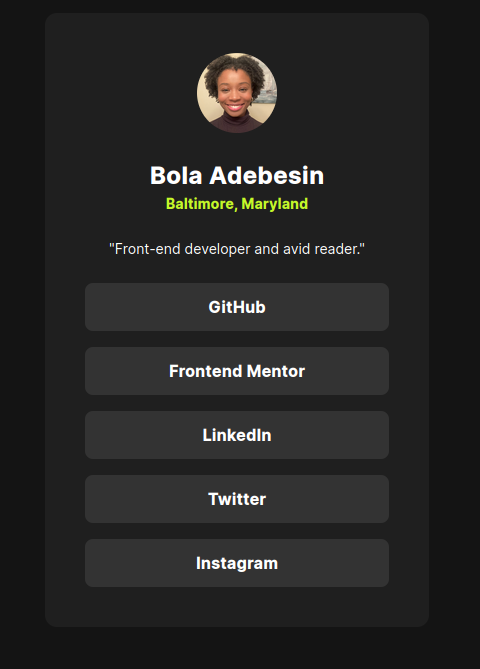

# Frontend Mentor - Social links profile solution

This is a solution to the [Social links profile challenge on Frontend Mentor](https://www.frontendmentor.io/challenges/social-links-profile-UG32l9m6dQ). Frontend Mentor challenges help you improve your coding skills by building realistic projects.

## Table of contents

- [Overview](#overview)
  - [The challenge](#the-challenge)
  - [Screenshot](#screenshot)
  - [Links](#links)
- [My process](#my-process)
  - [Built with](#built-with)
  - [What I learned](#what-i-learned)
  - [Continued development](#continued-development)
  - [Useful resources](#useful-resources)
- [Author](#author)

**Note: Delete this note and update the table of contents based on what sections you keep.**

## Overview

### The challenge

Users should be able to:

- See hover and focus states for all interactive elements on the page

### Screenshot



### Links

- [solution URL here](https://www.frontendmentor.io/solutions/social-links-page-GVSIpQa7j2)
- [live site URL here](https://social-links-profile-opal-delta.vercel.app/)

## My process

### Built with

- Semantic HTML5 markup
- CSS custom properties
- Flexbox
- CSS Grid
- Mobile-first workflow

### What I learned

I learned a more modern way to ensure that my projects use the content-box model so that component widths display as expected.

```css
html {
  box-sizing: border-box;
}
*,
*:before,
*:after {
  box-sizing: inherit;
}
```

### Continued development

I'm interested in learning about alternatives for importing fonts into my projects. I know it's possible to use a CDN which would result in less verbose code in my css files, but I want to understand the trade offs of different approaches.

### Useful resources

- [CSS Tricks](https://css-tricks.com/box-sizing/) - This helped me for with box-sizing. I really liked this pattern and will use it going forward.

## Author

- Website - [Bola Adebesin](https://www.badebesin.com/)
- Frontend Mentor - [@MobolanleAdebesin](https://www.frontendmentor.io/profile/MobolanleAdebesin)
